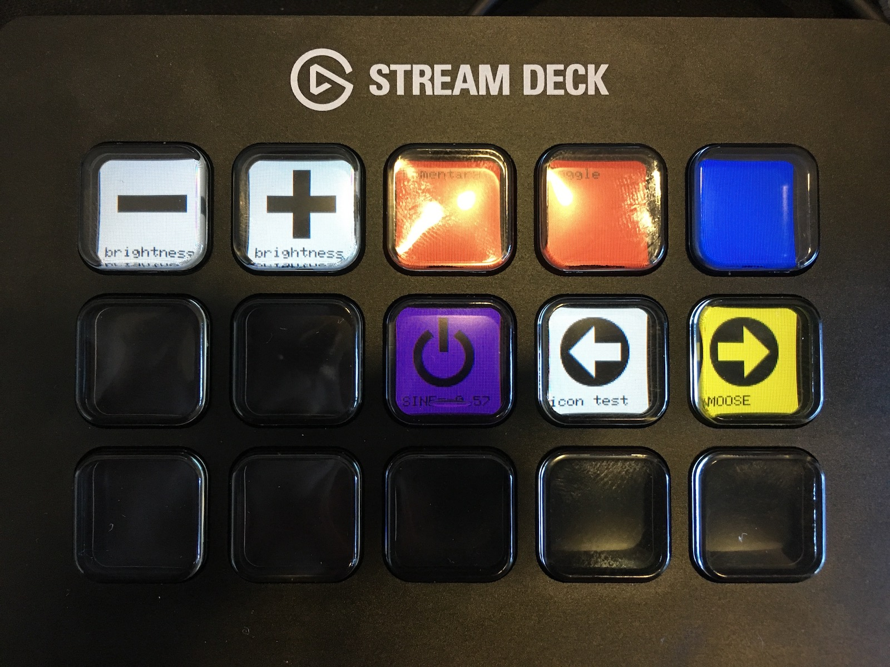

<span style="float: right;">

</span>

# Elgato StreamDeck

[Elgato StreamDeck](https://www.elgato.com/en/gaming/stream-deck) button controller Hardware Component for ScopeFoundry.

This interface uses the StreamDeck library by [abcminiuser](https://github.com/abcminiuser/python-elgato-streamdeck)
which relies on the hidapi backend.

Bitmap font and library from [AdaFruit by Tony DiCola](https://github.com/adafruit/micropython-adafruit-bitmap-font)

Icons from [Open Iconic](https://useiconic.com/open)

These libraries are used under the terms of the [MIT licence](https://opensource.org/licenses/MIT)

This software is not made by or endorsed by Elgato Systems GmbH.


# Install

```
pip install git+https://github.com/ScopeFoundry/HW_elgato_streamdeck.git
```

# Tutorial

```python
from ScopeFoundry import BaseMicroscopeApp
from ScopeFoundryHW.elgato_streamdeck.elgato_streamdeck_hw import ElgatoStreamDeckHW

class StreamDeckTestApp(BaseMicroscopeApp):
    
    name = 'streamdeck_testapp'
    
    def setup(self):
        
        hw = self.add_hardware(ElgatoStreamDeckHW(self))
        
        key_image_format = hw.deck.key_image_format()
    
        width, height = (key_image_format['width'], key_image_format['height'])
        depth = key_image_format['depth']

        grid_x, grid_y = np.mgrid[0:1:width*1j, 0:1:height*1j]
        img = np.ones((height, width, depth), dtype=int)
        print(img.shape)
        img[:,:,0] = 255
        
        hw.deck.set_key_image(0, img.flat)
        
        hw.connect_key_to_lq_toggle(1, hw.settings.debug_mode, text="Toggle")
        hw.connect_key_to_lq_momentary(2, hw.settings.debug_mode, text="Momentary")
        
        def inc_brightness():
            hw.settings['brightness'] += 5
        hw.add_key_press_listener(3, inc_brightness)
        hw.set_key_image(3, hw.img_icon("plus", text='brightness'))

        def dec_brightness():
            hw.settings['brightness'] -= 5
        hw.add_key_press_listener(4, dec_brightness)
        hw.set_key_image(4, hw.img_icon("minus", text='brightness'))
        
        hw.set_key_image(6, hw.img_icon("arrow-circle-left", text="icon test") )
        hw.set_key_image(5, hw.img_icon("arrow-circle-right", text=" MOOSE", bgcolor='yellow' ))      
        
```

Your Stream Deck should look like this:

